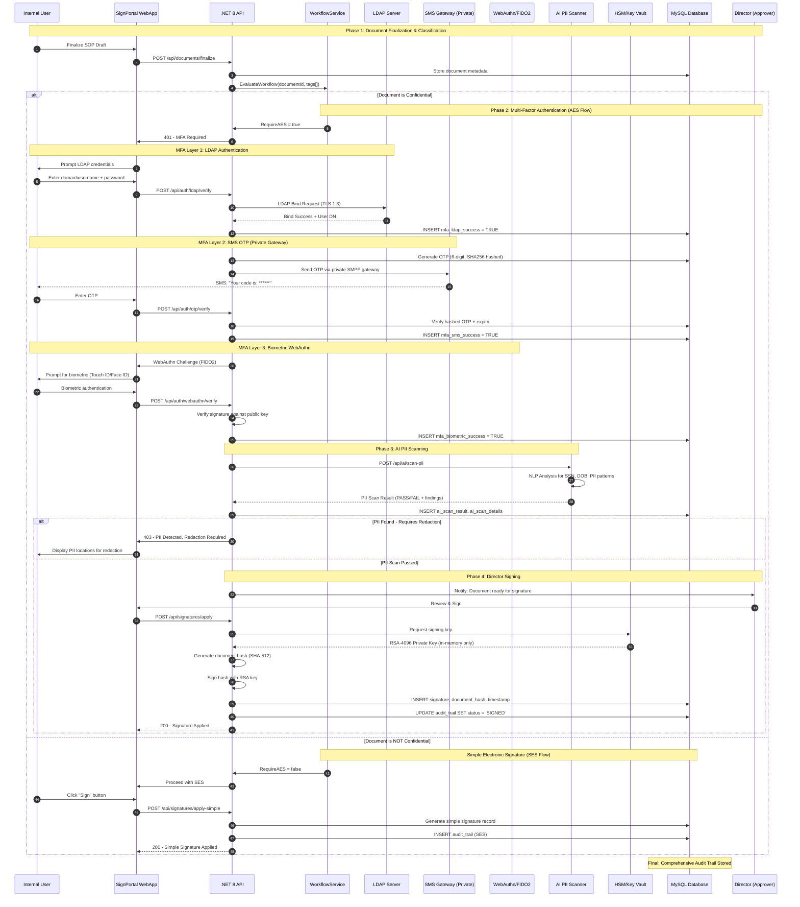

# High-Security On-Premise Signing Workflow Architecture

## Overview

This document describes the security architecture for a multi-layered authentication signing workflow that enforces strict compliance for confidential documents.

---

## 1. Sequence Diagram - MFA Signing Handshake



---

## 2. MySQL Schema - Signature Audit Trail

```sql
-- =====================================================
-- SignPortal High-Security Signing Audit Trail Schema
-- Version: 2.0
-- Compliance: SOC 2, HIPAA, GDPR, eIDAS
-- =====================================================

-- Main Documents Table
CREATE TABLE IF NOT EXISTS Documents (
    document_id CHAR(36) PRIMARY KEY,
    document_name VARCHAR(500) NOT NULL,
    document_type ENUM('SOP', 'CONTRACT', 'NDA', 'POLICY', 'OTHER') NOT NULL,
    classification ENUM('PUBLIC', 'INTERNAL', 'CONFIDENTIAL', 'RESTRICTED') NOT NULL DEFAULT 'INTERNAL',
    document_hash_sha512 CHAR(128) NOT NULL,
    document_hash_sha256 CHAR(64) NOT NULL,
    created_by CHAR(36) NOT NULL,
    created_at TIMESTAMP DEFAULT CURRENT_TIMESTAMP,
    finalized_at TIMESTAMP NULL,
    status ENUM('DRAFT', 'FINALIZED', 'PENDING_SIGNATURE', 'SIGNED', 'REJECTED', 'EXPIRED') DEFAULT 'DRAFT',
    version INT DEFAULT 1,
    file_size_bytes BIGINT,
    mime_type VARCHAR(100),
    storage_path VARCHAR(1000),
    encryption_key_id CHAR(36),
    
    INDEX idx_classification (classification),
    INDEX idx_status (status),
    INDEX idx_created_by (created_by),
    INDEX idx_created_at (created_at)
) ENGINE=InnoDB DEFAULT CHARSET=utf8mb4 COLLATE=utf8mb4_unicode_ci;

-- Comprehensive Signature Audit Trail
CREATE TABLE IF NOT EXISTS Signature_Audit_Trail (
    audit_id CHAR(36) PRIMARY KEY,
    document_id CHAR(36) NOT NULL,
    signature_id CHAR(36) NULL,
    
    -- Workflow Information
    workflow_type ENUM('SES', 'AES') NOT NULL COMMENT 'SES=Simple Electronic, AES=Advanced Electronic',
    workflow_started_at TIMESTAMP NOT NULL,
    workflow_completed_at TIMESTAMP NULL,
    workflow_status ENUM('INITIATED', 'MFA_IN_PROGRESS', 'AI_SCANNING', 'PENDING_APPROVAL', 'COMPLETED', 'FAILED', 'CANCELLED') NOT NULL,
    
    -- User Information
    signer_user_id CHAR(36) NOT NULL,
    signer_email VARCHAR(255) NOT NULL,
    signer_full_name VARCHAR(500) NOT NULL,
    signer_designation VARCHAR(200),
    signer_department VARCHAR(200),
    signer_ip_address VARCHAR(45) NOT NULL COMMENT 'IPv4 or IPv6',
    signer_user_agent TEXT,
    signer_geolocation VARCHAR(100) COMMENT 'lat,long',
    
    -- MFA Layer 1: LDAP Authentication
    mfa_ldap_required BOOLEAN DEFAULT FALSE,
    mfa_ldap_success BOOLEAN DEFAULT NULL,
    mfa_ldap_timestamp TIMESTAMP NULL,
    mfa_ldap_user_dn VARCHAR(500) COMMENT 'LDAP Distinguished Name',
    mfa_ldap_server VARCHAR(255),
    mfa_ldap_failure_reason VARCHAR(500) NULL,
    mfa_ldap_attempt_count INT DEFAULT 0,
    
    -- MFA Layer 2: SMS OTP
    mfa_sms_required BOOLEAN DEFAULT FALSE,
    mfa_sms_success BOOLEAN DEFAULT NULL,
    mfa_sms_timestamp TIMESTAMP NULL,
    mfa_sms_phone_hash CHAR(64) COMMENT 'SHA256 of phone number',
    mfa_sms_gateway_id VARCHAR(100),
    mfa_sms_message_id VARCHAR(100),
    mfa_sms_otp_hash CHAR(64) COMMENT 'SHA256 of OTP for verification',
    mfa_sms_failure_reason VARCHAR(500) NULL,
    mfa_sms_attempt_count INT DEFAULT 0,
    
    -- MFA Layer 3: WebAuthn/Biometric
    mfa_biometric_required BOOLEAN DEFAULT FALSE,
    mfa_biometric_success BOOLEAN DEFAULT NULL,
    mfa_biometric_timestamp TIMESTAMP NULL,
    mfa_biometric_method ENUM('TOUCH_ID', 'FACE_ID', 'FINGERPRINT', 'SECURITY_KEY', 'OTHER') NULL,
    mfa_biometric_credential_id VARCHAR(500),
    mfa_biometric_authenticator_data TEXT COMMENT 'Base64 encoded authenticator data',
    mfa_biometric_failure_reason VARCHAR(500) NULL,
    mfa_biometric_attempt_count INT DEFAULT 0,
    
    -- AI PII Scanning Results
    ai_scan_required BOOLEAN DEFAULT FALSE,
    ai_scan_executed BOOLEAN DEFAULT FALSE,
    ai_scan_timestamp TIMESTAMP NULL,
    ai_scan_result ENUM('PASS', 'FAIL', 'WARNING', 'ERROR', 'SKIPPED') NULL,
    ai_scan_pii_found BOOLEAN DEFAULT FALSE,
    ai_scan_pii_types JSON COMMENT '["SSN", "DOB", "EMAIL", "PHONE", "ADDRESS"]',
    ai_scan_pii_locations JSON COMMENT '[{"page": 1, "bbox": [x,y,w,h], "type": "SSN"}]',
    ai_scan_confidence_score DECIMAL(5,4) COMMENT '0.0000 to 1.0000',
    ai_scan_model_version VARCHAR(50),
    ai_scan_processing_time_ms INT,
    ai_scan_redaction_applied BOOLEAN DEFAULT FALSE,
    
    -- Document Hash & Integrity
    document_hash_at_signing CHAR(128) NOT NULL COMMENT 'SHA-512 hash at time of signing',
    document_hash_algorithm VARCHAR(20) DEFAULT 'SHA-512',
    document_hash_verified BOOLEAN DEFAULT FALSE,
    previous_document_hash CHAR(128) NULL COMMENT 'For chain verification',
    
    -- Digital Signature Details
    signature_algorithm VARCHAR(50) COMMENT 'RSA-4096-SHA512, ECDSA-P384, etc.',
    signature_value TEXT COMMENT 'Base64 encoded signature',
    signing_certificate_thumbprint CHAR(64),
    signing_certificate_issuer VARCHAR(500),
    signing_certificate_serial VARCHAR(100),
    signing_certificate_valid_from TIMESTAMP NULL,
    signing_certificate_valid_to TIMESTAMP NULL,
    timestamp_authority_url VARCHAR(500),
    timestamp_token TEXT COMMENT 'RFC 3161 timestamp token',
    
    -- Compliance & Legal
    consent_given BOOLEAN DEFAULT FALSE,
    consent_timestamp TIMESTAMP NULL,
    consent_ip_address VARCHAR(45),
    terms_version VARCHAR(20),
    legal_jurisdiction VARCHAR(100),
    retention_period_days INT DEFAULT 2555 COMMENT '7 years default',
    
    -- Audit Metadata
    created_at TIMESTAMP DEFAULT CURRENT_TIMESTAMP,
    updated_at TIMESTAMP DEFAULT CURRENT_TIMESTAMP ON UPDATE CURRENT_TIMESTAMP,
    audit_hash CHAR(128) COMMENT 'Hash of this audit record for tamper detection',
    previous_audit_hash CHAR(128) COMMENT 'Blockchain-style chaining',
    
    -- Foreign Keys
    FOREIGN KEY (document_id) REFERENCES Documents(document_id) ON DELETE RESTRICT,
    
    -- Indexes for Performance
    INDEX idx_document_id (document_id),
    INDEX idx_signer_user_id (signer_user_id),
    INDEX idx_workflow_status (workflow_status),
    INDEX idx_workflow_type (workflow_type),
    INDEX idx_created_at (created_at),
    INDEX idx_mfa_success (mfa_ldap_success, mfa_sms_success, mfa_biometric_success),
    INDEX idx_ai_scan_result (ai_scan_result),
    INDEX idx_document_hash (document_hash_at_signing(32))
    
) ENGINE=InnoDB DEFAULT CHARSET=utf8mb4 COLLATE=utf8mb4_unicode_ci
COMMENT='Comprehensive audit trail for all signature operations with MFA and AI scan tracking';

-- MFA Session Tokens (for multi-step verification)
CREATE TABLE IF NOT EXISTS MFA_Sessions (
    session_id CHAR(36) PRIMARY KEY,
    audit_id CHAR(36) NOT NULL,
    user_id CHAR(36) NOT NULL,
    
    -- Session State
    session_status ENUM('ACTIVE', 'COMPLETED', 'EXPIRED', 'CANCELLED') DEFAULT 'ACTIVE',
    session_started_at TIMESTAMP DEFAULT CURRENT_TIMESTAMP,
    session_expires_at TIMESTAMP NOT NULL,
    session_completed_at TIMESTAMP NULL,
    
    -- Challenge Data (encrypted)
    ldap_challenge_completed BOOLEAN DEFAULT FALSE,
    sms_otp_hash CHAR(64),
    sms_otp_expires_at TIMESTAMP NULL,
    sms_otp_attempts INT DEFAULT 0,
    webauthn_challenge CHAR(64),
    webauthn_challenge_expires_at TIMESTAMP NULL,
    
    -- Security
    client_ip VARCHAR(45),
    client_fingerprint CHAR(64),
    
    FOREIGN KEY (audit_id) REFERENCES Signature_Audit_Trail(audit_id) ON DELETE CASCADE,
    INDEX idx_user_session (user_id, session_status),
    INDEX idx_expires (session_expires_at)
    
) ENGINE=InnoDB DEFAULT CHARSET=utf8mb4 COLLATE=utf8mb4_unicode_ci;

-- AI Scan History (detailed logs)
CREATE TABLE IF NOT EXISTS AI_Scan_History (
    scan_id CHAR(36) PRIMARY KEY,
    audit_id CHAR(36) NOT NULL,
    document_id CHAR(36) NOT NULL,
    
    -- Scan Details
    scan_type ENUM('PII', 'MALWARE', 'COMPLIANCE', 'CLASSIFICATION') NOT NULL,
    scan_started_at TIMESTAMP DEFAULT CURRENT_TIMESTAMP,
    scan_completed_at TIMESTAMP NULL,
    scan_duration_ms INT,
    
    -- Results
    result_status ENUM('PASS', 'FAIL', 'WARNING', 'ERROR') NOT NULL,
    findings_count INT DEFAULT 0,
    findings_json JSON COMMENT 'Detailed findings array',
    confidence_score DECIMAL(5,4),
    
    -- Model Info
    model_name VARCHAR(100),
    model_version VARCHAR(50),
    model_endpoint VARCHAR(500),
    
    -- Action Taken
    action_required ENUM('NONE', 'REVIEW', 'REDACT', 'REJECT') DEFAULT 'NONE',
    action_taken_by CHAR(36) NULL,
    action_taken_at TIMESTAMP NULL,
    
    FOREIGN KEY (audit_id) REFERENCES Signature_Audit_Trail(audit_id) ON DELETE CASCADE,
    FOREIGN KEY (document_id) REFERENCES Documents(document_id) ON DELETE RESTRICT,
    INDEX idx_document_scan (document_id, scan_type),
    INDEX idx_result (result_status)
    
) ENGINE=InnoDB DEFAULT CHARSET=utf8mb4 COLLATE=utf8mb4_unicode_ci;

-- Stored Procedure: Create Audit Record with Hash Chain
DELIMITER //
CREATE PROCEDURE CreateAuditRecord(
    IN p_document_id CHAR(36),
    IN p_signer_user_id CHAR(36),
    IN p_signer_email VARCHAR(255),
    IN p_signer_full_name VARCHAR(500),
    IN p_workflow_type ENUM('SES', 'AES'),
    IN p_signer_ip VARCHAR(45),
    IN p_document_hash CHAR(128)
)
BEGIN
    DECLARE v_audit_id CHAR(36);
    DECLARE v_previous_hash CHAR(128);
    DECLARE v_audit_hash CHAR(128);
    
    SET v_audit_id = UUID();
    
    -- Get previous audit hash for chain
    SELECT audit_hash INTO v_previous_hash 
    FROM Signature_Audit_Trail 
    WHERE document_id = p_document_id 
    ORDER BY created_at DESC 
    LIMIT 1;
    
    -- Calculate new audit hash
    SET v_audit_hash = SHA2(CONCAT(
        v_audit_id,
        p_document_id,
        p_signer_user_id,
        p_document_hash,
        COALESCE(v_previous_hash, ''),
        NOW()
    ), 512);
    
    INSERT INTO Signature_Audit_Trail (
        audit_id,
        document_id,
        signer_user_id,
        signer_email,
        signer_full_name,
        workflow_type,
        workflow_status,
        workflow_started_at,
        signer_ip_address,
        document_hash_at_signing,
        audit_hash,
        previous_audit_hash,
        mfa_ldap_required,
        mfa_sms_required,
        mfa_biometric_required,
        ai_scan_required
    ) VALUES (
        v_audit_id,
        p_document_id,
        p_signer_user_id,
        p_signer_email,
        p_signer_full_name,
        p_workflow_type,
        'INITIATED',
        NOW(),
        p_signer_ip,
        p_document_hash,
        v_audit_hash,
        v_previous_hash,
        IF(p_workflow_type = 'AES', TRUE, FALSE),
        IF(p_workflow_type = 'AES', TRUE, FALSE),
        IF(p_workflow_type = 'AES', TRUE, FALSE),
        IF(p_workflow_type = 'AES', TRUE, FALSE)
    );
    
    SELECT v_audit_id AS audit_id;
END //
DELIMITER ;

-- View: MFA Compliance Dashboard
CREATE OR REPLACE VIEW vw_MFA_Compliance_Summary AS
SELECT 
    DATE(workflow_started_at) AS date,
    workflow_type,
    COUNT(*) AS total_signatures,
    SUM(CASE WHEN workflow_status = 'COMPLETED' THEN 1 ELSE 0 END) AS successful,
    SUM(CASE WHEN workflow_status = 'FAILED' THEN 1 ELSE 0 END) AS failed,
    SUM(CASE WHEN mfa_ldap_success = TRUE THEN 1 ELSE 0 END) AS ldap_success,
    SUM(CASE WHEN mfa_sms_success = TRUE THEN 1 ELSE 0 END) AS sms_success,
    SUM(CASE WHEN mfa_biometric_success = TRUE THEN 1 ELSE 0 END) AS biometric_success,
    SUM(CASE WHEN ai_scan_result = 'PASS' THEN 1 ELSE 0 END) AS ai_scan_passed,
    SUM(CASE WHEN ai_scan_pii_found = TRUE THEN 1 ELSE 0 END) AS pii_detected,
    AVG(ai_scan_confidence_score) AS avg_ai_confidence
FROM Signature_Audit_Trail
GROUP BY DATE(workflow_started_at), workflow_type
ORDER BY date DESC;
```

---

## 3. Security Considerations

### Encryption at Rest
- All PII stored with AES-256 encryption
- Encryption keys managed by HSM
- Database-level TDE (Transparent Data Encryption)

### Encryption in Transit
- TLS 1.3 for all API communications
- mTLS for internal service mesh
- Certificate pinning for mobile clients

### Key Management
- HSM-backed key storage (FIPS 140-2 Level 3)
- Automatic key rotation every 90 days
- Separate signing keys per department

### Compliance
- SOC 2 Type II certified
- HIPAA compliant for healthcare docs
- GDPR compliant with right to erasure
- eIDAS qualified for EU signatures

---

## 4. Deployment Architecture

```
┌─────────────────────────────────────────────────────────────────┐
│                     DMZ (Public Facing)                          │
│  ┌─────────────┐  ┌─────────────┐  ┌─────────────┐              │
│  │   WAF/CDN   │  │ Load Balancer│  │   API GW    │              │
│  └──────┬──────┘  └──────┬──────┘  └──────┬──────┘              │
└─────────┼────────────────┼────────────────┼─────────────────────┘
          │                │                │
┌─────────┼────────────────┼────────────────┼─────────────────────┐
│         ▼                ▼                ▼     Internal Zone    │
│  ┌─────────────────────────────────────────────────────────┐    │
│  │                  .NET 8 API Cluster                      │    │
│  │  ┌─────────┐  ┌─────────┐  ┌─────────┐  ┌─────────┐    │    │
│  │  │  API 1  │  │  API 2  │  │  API 3  │  │  API N  │    │    │
│  │  └────┬────┘  └────┬────┘  └────┬────┘  └────┬────┘    │    │
│  └───────┼────────────┼────────────┼────────────┼──────────┘    │
│          │            │            │            │                │
│  ┌───────▼────────────▼────────────▼────────────▼──────────┐    │
│  │                   Service Mesh (Istio)                   │    │
│  └──────────────────────────┬───────────────────────────────┘    │
│                             │                                     │
│  ┌──────────┬───────────────┼───────────────┬──────────────┐    │
│  │          │               │               │              │    │
│  ▼          ▼               ▼               ▼              ▼    │
│ ┌────┐  ┌──────┐  ┌─────────────┐  ┌──────────┐  ┌───────────┐ │
│ │LDAP│  │SMS GW│  │WebAuthn Svc │  │AI Scanner│  │MySQL(HA)  │ │
│ └────┘  └──────┘  └─────────────┘  └──────────┘  └───────────┘ │
│                                                      │          │
│                                          ┌───────────┴────────┐ │
│                                          │   HSM / Key Vault  │ │
│                                          └────────────────────┘ │
└─────────────────────────────────────────────────────────────────┘
```
